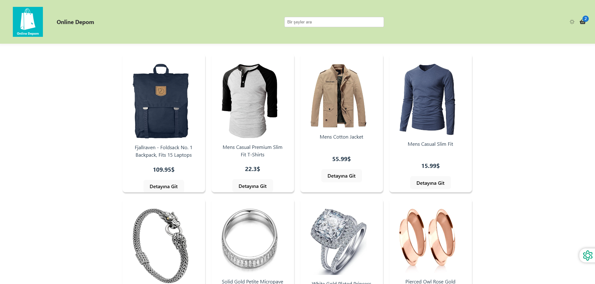
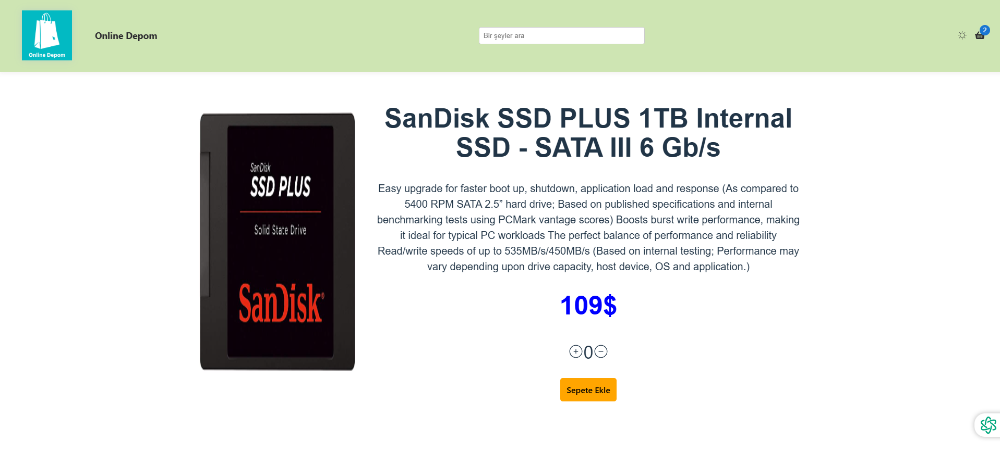
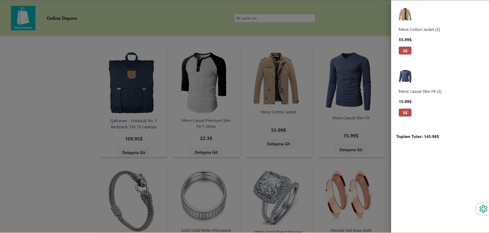

# E-Commerce React App





This project is developed as a basic e-commerce application. Users can browse products, add them to the cart, and view the total price of items in the cart. The project utilizes modern JavaScript technologies and tools.


## Features

- **Product Listing:** Fetch product data from an API using Axios.
- **Add to Cart:** Users can add products to the cart, and the quantity and total price are updated in real-time.
- **Redux Toolkit:** Used for global state management.
- **MUI (Material UI):** UI components are styled using Material UI.
- **Theme Toggle:** Dark and light mode options are available.
- **React Router:** Enables navigation between different pages.

## Technologies and Tools Used

- **React:** JavaScript library for building the user interface.
- **Redux Toolkit:** For global state management.
- **React Router:** For handling page navigation.
- **Axios:** For making HTTP requests to fetch product data.
- **MUI (Material UI):** For UI components and styling.
- **React Hooks:** Used for managing state (`useState`), side effects (`useEffect`), and other component logic.

## Installation

Follow these steps to get the project running locally:

### 1. Clone the repository

```bash
git clone https://github.com/1mertyuksel/e-commerce-app.git
cd e-commerce-app
